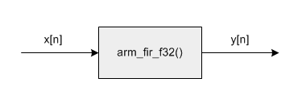
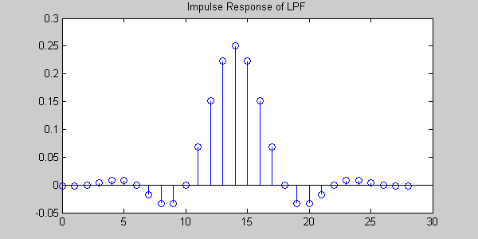
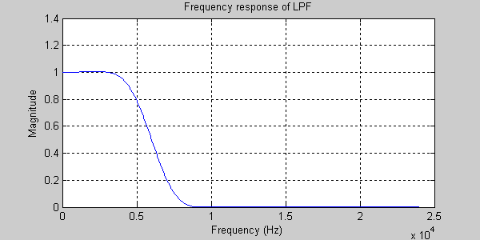
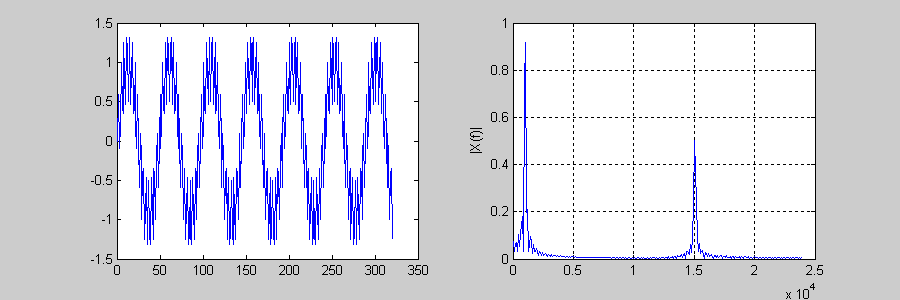
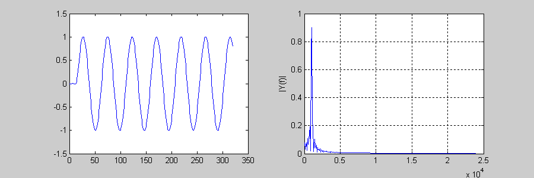

# FIR Lowpass Filter Example

## Description

Removes high frequency signal components from the input using an FIR lowpass filter. The example demonstrates how to configure an FIR filter and then pass data through it in a block-by-block fashion.

## Algorithm

The input signal is a sum of two sine waves: 1 kHz and 15 kHz. This is processed by an FIR lowpass filter with cutoff frequency 6 kHz. The lowpass filter eliminates the 15 kHz signal leaving only the 1 kHz sine wave at the output.

The lowpass filter was designed using MATLAB with a sample rate of 48 kHz and a length of 29 points. The MATLAB code to generate the filter coefficients is shown below:

$$
h = fir1(28, 6/24);
$$

The first argument is the "order" of the filter and is always one less than the desired length. The second argument is the normalized cutoff frequency. This is in the range 0 (DC) to 1.0 (Nyquist). A 6 kHz cutoff with a Nyquist frequency of 24 kHz lies at a normalized frequency of 6/24 = 0.25. The CMSIS FIR filter function requires the coefficients to be in time reversed order.

$$
fliplr(h)
$$

The resulting filter coefficients and are shown below. Note that the filter is symmetric (a property of linear phase FIR filters) and the point of symmetry is sample 14. Thus the filter will have a delay of 14 samples for all frequencies.

The frequency response of the filter is shown next. The passband gain of the filter is 1.0 and it reaches 0.5 at the cutoff frequency 6 kHz.

The input signal is shown below. The left hand side shows the signal in the time domain while the right hand side is a frequency domain representation. The two sine wave components can be clearly seen.

The output of the filter is shown below. The 15 kHz component has been eliminated.

## Variables Description

| Variable         | Description                                      |
|------------------|--------------------------------------------------|
| `testInput_f32_1kHz_15kHz`  | points to the input data |
| `refOutput`      | points to the reference output data|
| `testOutput`      | points to the test output data |
| `firStateF32`           | points to state buffer|
| `firCoeffs32`            |points to coefficient buffer|
| `blockSize`            | number of samples processed at a time|
| `numBlocks`    | number of frames |

### dspic33-cmsis-dspdsp Functions Used

- `mchp_fir_init_f32()` – Initialize a FIR structure.
- `mchp_fir_f32()` – Perform FIR Filter operation.
