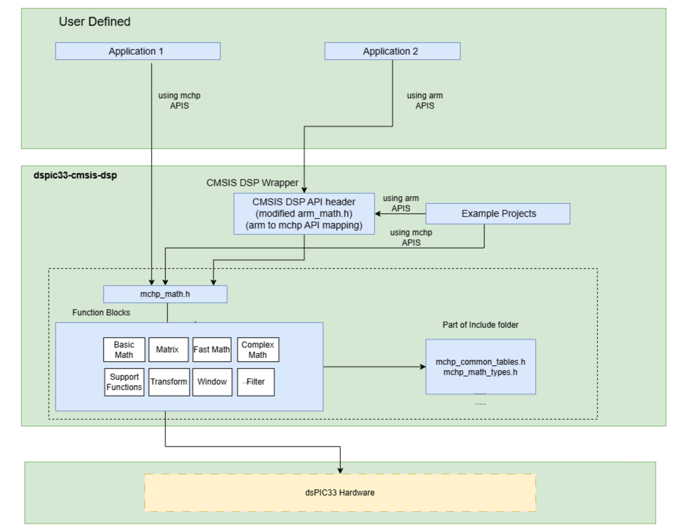

[](https://github.com/microchip-pic-avr-solutions/dspic33-cmsis-dsp/releases/latest)

# DSP library for dsPIC33 Device family compatible with CMSIS-DSP APIs

## Table of Contents
- [Description](#description)
- [dspic33-cmsis-dsp Library Functions](#dspic33-cmsis-dsp-library-functions)
- [Folder Structure](#folder-structure)
- [How to Build](#how-to-build)
  - [Prerequisites](#prerequisites)
  - [Building and Using the Pre-Compiled Library](#building-and-using-the-pre-compiled-library)
  - [Building and Running Example Projects](#building-and-running-example-projects)
- [Support / Contact](#support--contact)
- [Product Support](#product-support)
- [License](#license)

> **Note:** `xxx` indicates datatype floating-point (f32) and fixed point (q31).

## Description
dspic33-cmsis-dsp is a software library for achieving DSP functionality.

It provides optimized compute features specifically for dsPIC33 cores and supports floating point(f32) using the hardware FPU unit and fixed point functions(q31).

The following diagram provides an overview of the dspic33-cmsis-dsp library architecture:



**Block Diagram Overview:**
- API layers are designed to maintain compatibility across supported dsPIC33 devices.
- Hardware-specific optimizations are encapsulated within the static library, keeping application code portable.
- The architecture allows seamless migration between MCHP specific APIs and standard CMSIS DSP APIs.

The above structure allows users to easily integrate the library into their projects, reference the API, and explore example implementations.

### dspic33-cmsis-dsp Library Functions
Functions provided by dspic33-cmsis-dsp library:

* Basic mathematics
* Filtering functions
* Complex mathematics
* Transforms
* Matrix
* Statistics
* Window

Functions are provided with datatype: f32, q31.

## Folder Structure
* Documentation - the compiled documentation about the dspic33-cmsis-dsp library.
* Examples - MPLAB®X IDE Example projects demonstrating some of the floating point operations and fixed operations(e.g., Filtering, Transform, Matrix).
* Include - the header files (.h) to build dspic33-cmsis-dsp library. Modified CMSIS DSP header files supporting only f32 and q31 functions (as per Apache license)
* PrivateInclude - the include files (.inc) to build dspic33-cmsis-dsp library.
* Source - the source files (.s, .c) to build dspic33-cmsis-dsp library.
* Library - the precompiled library named `libcmsis-dsp-dspic33-elf-f32.a/libcmsis-dsp-dspic33-elf-q31.a` and the scripts to build library file for datatype q31 and f32.
* Utils - the util source files to build dspic33-cmsis-dsp library.

## How to Build
This section describes how to build and use the dspic33-cmsis-dsp library with dsPIC33 devices.

1. [Building Using the Pre-Compiled Library](#1-building-and-using-the-pre-compiled-library)
2. [Building and Running Example Projects](#2-building-and-running-example-projects)
3. [Building Using the Source Files](#3-building-using-the-source-files)

### Prerequisites
- **MPLAB® X IDE** v6.30 or later
- **XC-DSC Compiler** v3.31.00 or later
- **dsPIC33 packs** download from https://packs.download.microchip.com/
- dspic33-cmsis-dsp repository cloned or downloaded

### 1. Building and Using the Pre-Compiled Library
The dspic33-cmsis-dsp library is provided as a pre-compiled static library (`libcmsis-dsp-dspic33-elf-f32.a / libcmsis-dsp-dspic33-elf-q31.a`).

> **Note:** If you are using transform initialization functions such as `cfft_init_xxx` or `rfft_init_xxx`, be sure to add  
> `Source/CommonTables/mchp_common_tables.c` to the **Source Files** section of your `.X` project.  
> This file contains the implementations required by the transform initialization functions.

**Steps:**
1. Open **MPLAB®X IDE**.
2. Create a new **Standalone Project** for your target **dsPIC33** device.
3. Select **XC-DSC** as the compiler toolchain.
4. Add the dspic33-cmsis-dsp library:
   - Right-click **Libraries** in the Project Tree
   - Select **Add Library/Object File**
   - Browse to the `Library/xxx` folder and select the `libcmsis-dsp-dspic33-elf-xxx.a` file
5. Add the public header files:
   - Right-click **Header Files** → **Add Existing Item**
   - Add the required `.h` files from the `Include/` directory
6. Configure include paths:
   - Open **Project Properties**
   - Navigate to **XC-DSC Compiler → Include Directories**
   - Add the path to the `Include/` directory
7. Build the project.

---

### 2. Building and Running Example Projects
Example projects demonstrate how to integrate and use the dspic33-cmsis-dsp library.

> **Note:** If you are using transform initialization functions such as `cfft_init_xxx` or `rfft_init_xxx`, ensure that  
> `Source/CommonTables/mchp_common_tables.c` is added to the **Source Files** of your `.X` project.  
> This file is **already included in the example projects**, which you can refer to for guidance.

**Steps:**
1. Open **MPLAB®X IDE**.
2. Select **File → Open Project**.
3. Navigate to the `Examples/` directory.
4. Open the desired `.X` project.
5. Verify the selected device and XC-DSC compiler version.
6. Build and (optionally) program the target device.

### 3. Building Using the Source Files

1. **Create a New Project**
   - Open **MPLAB® X IDE**
   - Create a **Standalone Project**
   - Select the target **dsPIC33** device
   - Choose **XC-DSC** as the compiler toolchain

2. **Add Source Files**
   Add the following folders and files from the dspic33-cmsis-dsp repository to your project:

   **C and Assembly Source Files**
   - `Source/`
   - `Utils/`
   - All or necessary `.c` and `.s` files contained in these directories

3. **Add Header Files**
   - Right‑click **Header Files** → **Add Existing Item**
   - Add the required `.h`, `inc` files from:
     - `Include/`
     - `PrivateInclude/`

4. **Configure Include Paths**
   - Open **Project Properties**
   - Navigate to **XC-DSC Compiler → Include Directories**
   - Add the following paths:
     ```
     <path-to-dspic33-cmsis-dsp>/Include
     <path-to-dspic33-cmsis-dsp>/PrivateInclude
     ```

5. **Compiler Optimization Settings (Recommended)**
   - Open **Project Properties → XC-DSC Compiler → Optimization**
   - Recommended optimization level:
     ```
     -O2 or -O3
     ```

6. **Build the Project**
   - Click **Build Project**
   - The dspic33-cmsis-dsp source files will be compiled and linked directly into your application.

## Support / Contact
For any questions or to reach the dspic33-cmsis-dsp team, please create a new issue at:  
https://github.com/microchip-pic-avr-solutions/dspic33-cmsis-dsp/issues

## Product Support
Currently, this library supports the following Microchip product lines:
* dsPIC33A

For dsPIC33A device support, please visit:  
https://www.microchip.com/en-us/products/microcontrollers/dspic-dscs/dspic33a

# License
This library is licensed under the [](https://github.com/microchip-pic-avr-solutions/dspic33-cmsis-dsp/blob/main/LICENSE).
